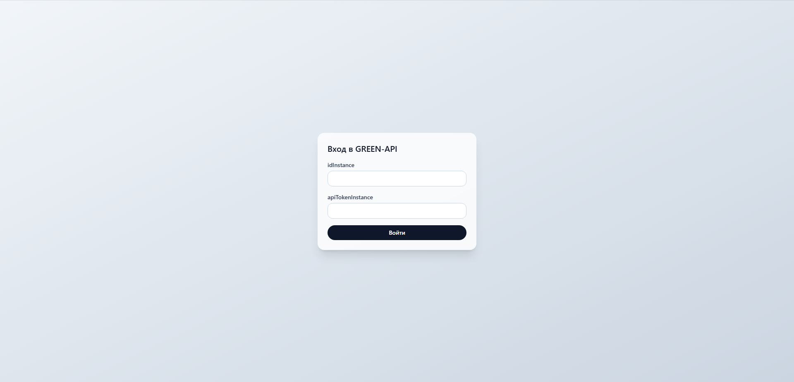
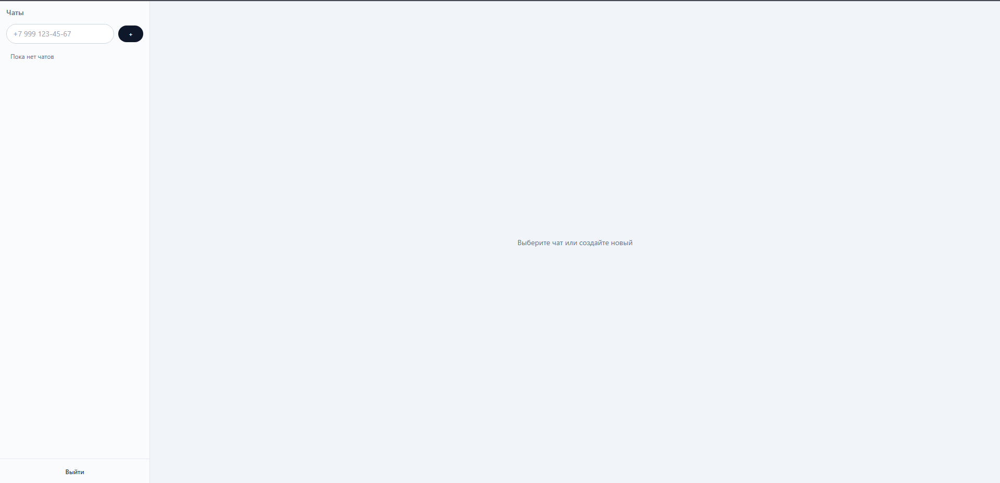
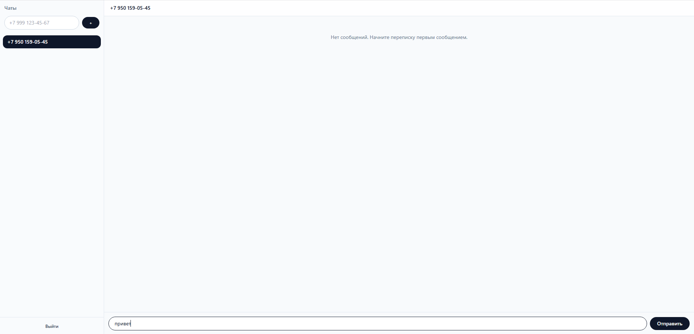
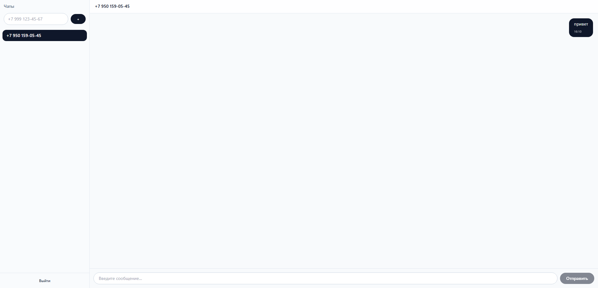
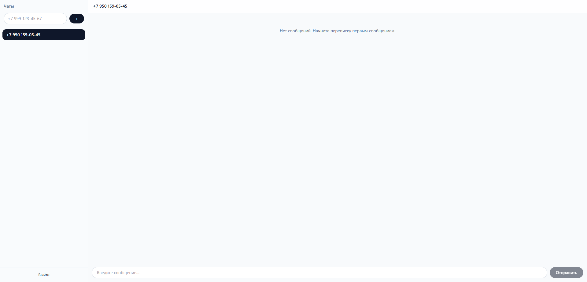
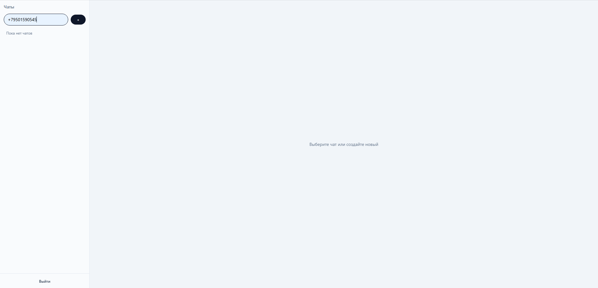

# GREEN-API Chat

Тестовое задание: SPA на React + TypeScript для отправки и получения текстовых сообщений через GREEN-API (мессенджер MAX).

Репозиторий проекта: https://github.com/Saburelena/green-api-chat

## Описание

Приложение для работы с GREEN-API: вход в аккаунт, создание чатов, отправка сообщений и получение входящих уведомлений. В логике предусмотрен polling, обработка ошибок и базовый статус offline/online.

В проекте предусмотрен два режима:

- реальный режим с GREEN-API;
- demo-режим с mock-данными для локального запуска и демонстрации интерфейса без реального инстанса.

## Что реализовано

- авторизация по `idInstance` и `apiTokenInstance`;
- создание чата по номеру телефона;
- отправка текстовых сообщений через GREEN-API;
- получение входящих сообщений по polling;
- удаление обработанных уведомлений;
- сохранение авторизации в sessionStorage;
- локальное хранение чатов и сообщений;
- состояние загрузки и ошибки при отправке сообщения;
- базовая валидация входных данных;
- demo-режим с mock-данными для безопасной демонстрации.

## Стек

- React 18
- TypeScript 5.5
- Vite 5
- React Router v6
- Zustand
- Axios
- Tailwind CSS
- ESLint
- Prettier
- Vitest
- Feature-Sliced Design

## Архитектура

Проект разделён по слоям `app → pages → widgets → features → entities → shared`.

Основная логика вынесена в feature- и entity-слои, а HTTP-взаимодействие инкапсулировано в интерфейс `IGreenApiClient`. Конкретная реализация `GreenApiClient` создаётся через DI-контейнер, что позволяет легко переключаться между реальным сервисом и mock-данными.

## Переменные окружения

Перед запуском нужно создать файл `.env` по шаблону `.env.example`:

```bash
cp .env.example .env
```

Пример содержимого:

```env
VITE_GREEN_API_URL=https://api.green-api.com
VITE_POLL_INTERVAL_MS=5000
VITE_USE_MOCK=false
```

## Запуск проекта

### Реальный режим

```bash
npm install
npm run dev
```

### Demo-режим с mock-данными

```bash
VITE_USE_MOCK=true npm run dev
```

Приложение будет доступно по адресу:

```bash
http://localhost:5173/
```

## Скрипты

```bash
npm run dev
npm run build
npm run typecheck
npm run lint
npm run test
```

## Проверка качества

Проект проверяется через:

- TypeScript;
- ESLint;
- Vitest;
- production build через Vite.

## Демо

Ссылка на публичную демо-версию:

https://green-api-chat-1fvczbmi7-saburelena.vercel.app/login

Для реального использования с GREEN-API нужно включить `VITE_USE_MOCK=false` и указать свои `idInstance` и `apiTokenInstance`.

## Скриншоты

Финальные скриншоты приложения находятся в папке `public/screenshots/`.

Примеры:

- `public/screenshots/login.png` — стартовый экран авторизации
- `public/screenshots/chat-empty.png` — пустое состояние чатов
- `public/screenshots/chat-list.png` — список чатов и поле ввода сообщения
- `public/screenshots/chat-message.png` — отправленное сообщение в чате
- `public/screenshots/message-thread.png` — открытый диалог с номером собеседника
- `public/screenshots/chat-active.png` — активное состояние чата

```md











```

## Итог

Проект реализован как тестовое задание на React + TypeScript для работы с GREEN-API и обмена текстовыми сообщениями в мессенджере MAX. Основная цель — показать рабочую логику авторизации, отправки сообщений, polling входящих уведомлений и структуру приложения в современном frontend-стеке. Сценарии для реального использования и для demo-режима поддерживаются одновременно.

## Сертификат

[](https://green-api.com/certificates/developer/d7baa186d1554b96.pdf)

Сертификат: [PDF](https://green-api.com/certificates/developer/d7baa186d1554b96.pdf)

Номер сертификата: 2243697  
Дата выдачи: 25.09.2026

Этот проект был проверен и верифицирован в рамках тестового задания GREEN-API.